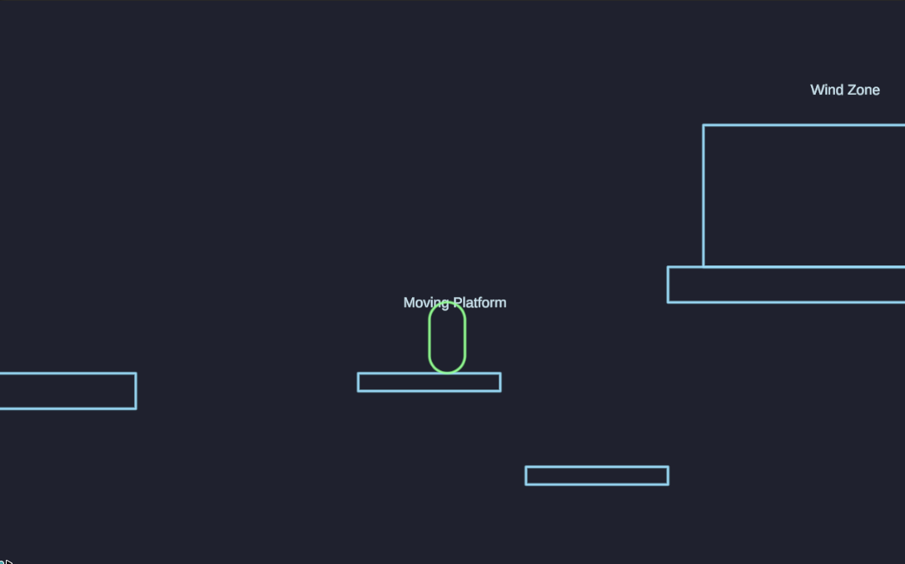

# Zori Entities Character Controller 2D

A DOTS 2D kinematic character controller for Entities — a faithful 2D port of Unity's `com.unity.charactercontroller`, built on `is.zori.entities.physics2d`.

It reduces the 3D controller to the plane: collide-and-slide movement, grounding, step and slope handling, and character ↔ dynamic-body interactions, with the same processor-callback extensibility. It drives a kinematic body through the substrate's swept `MovePosition` commands and writes only the entity's pose, so it is renderer-agnostic.

## Install

Add the package by git URL (Package Manager → Add package from git URL), or in `Packages/manifest.json`:

```json
"dependencies": {
  "is.zori.entities.charactercontroller2d": "https://github.com/api-haus/is.zori.entities.charactercontroller2d.git"
}
```

You can also drop the package into your project's `Packages/` folder as an embedded package. It needs `is.zori.entities.physics2d` present the same way (git URL or embedded).

## Platformer sample

A 2D rendition of Unity's Platformer sample: a capsule kinematic character with `GroundMove` / `AirMove` / `RopeSwing` stances and per-character movement tuning, in a course exercising moving platforms, force/wind zones, friction-modifier surfaces, teleporters, and rope swings — every feature built on the controller and the `is.zori.entities.physics2d` substrate. Import it from Package Manager → Zori Entities Character Controller 2D → Samples → Platformer Character → Import, then open the imported scene and enter Play mode (A/D or arrows move, Space/W jumps, E grabs a rope, Q releases).



## Features

- **Collide-and-slide movement.** The character sweeps its cast proxy against the substrate's queries, slides along hits, and depenetrates from overlaps each fixed step.
- **Grounding.** Ground detection with snap-to-ground, the grounded/ungrounded transition predicates, and a per-update grounding-up axis.
- **Step and slope handling.** `BasicStepAndSlopeHandlingParameters2D` drives stepping up over ledges and walking slopes within a max angle.
- **Character ↔ dynamic-body interactions.** Impulses are exchanged with dynamic Box2D bodies the character hits, with per-hit mass overrides.
- **Parents and moving platforms.** A character riding a moving body inherits its velocity and parent-relative motion.
- **Processor extensibility.** `IKinematicCharacterProcessor2D<C>` exposes the six solve callbacks (grounding-up, collision/grounding filters, movement-hit response, velocity projection, hit-mass override); `DefaultKinematicCharacterProcessor2D` is the stock implementation.
- **Single authoring component.** `CharacterController2DAuthoring` carries the character properties, step/slope parameters, and a circle/box/capsule cast proxy; its baker emits the full ECS character archetype plus the matching substrate kinematic body and shape.
- **Renderer-agnostic.** The solve writes only the entity's pose via swept `MovePosition`; nothing about a renderer is assumed.

## Requirements

- Unity 6000.x — developed and validated against `6000.6.0a6`.
- `is.zori.entities.physics2d` — the controller solves against its query surface and drives its kinematic bodies.
- Entities 6.5, Collections 6.5, Burst 1.8.29, Mathematics 1.3.2

## License

MIT (declared in `package.json`).
